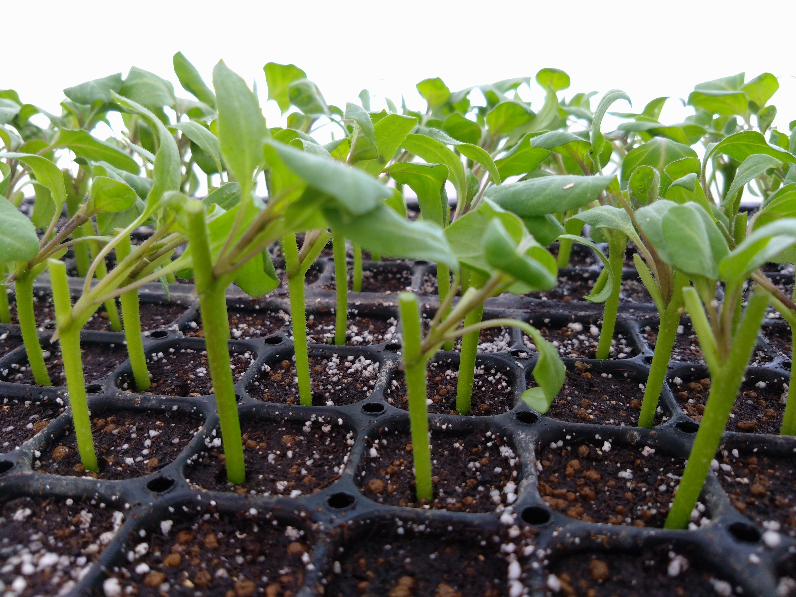
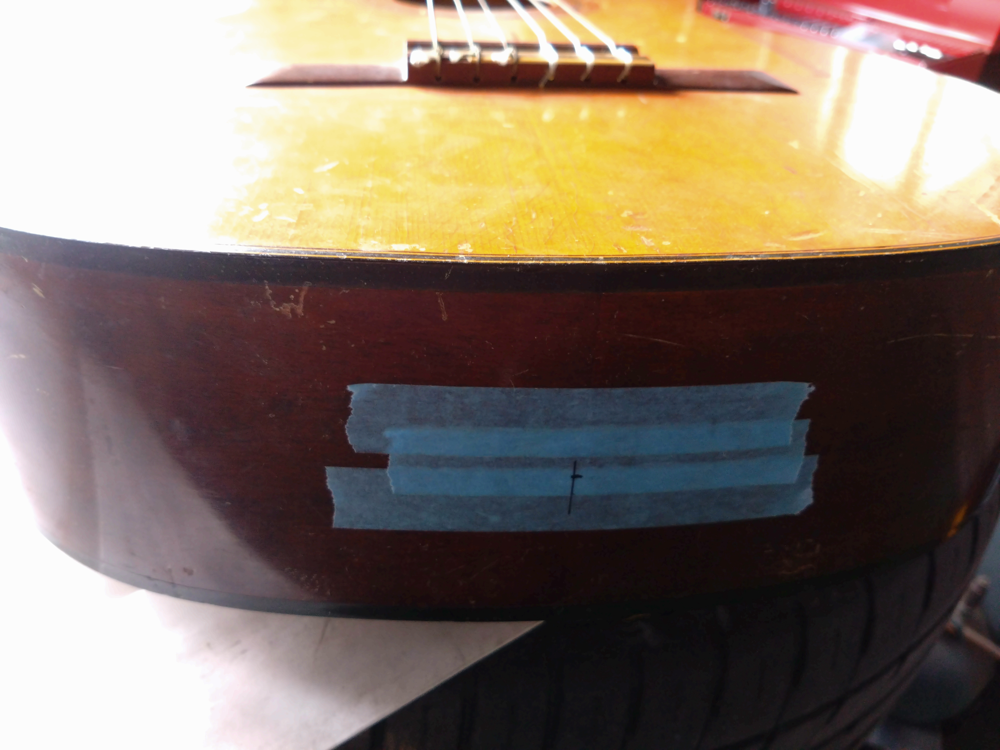
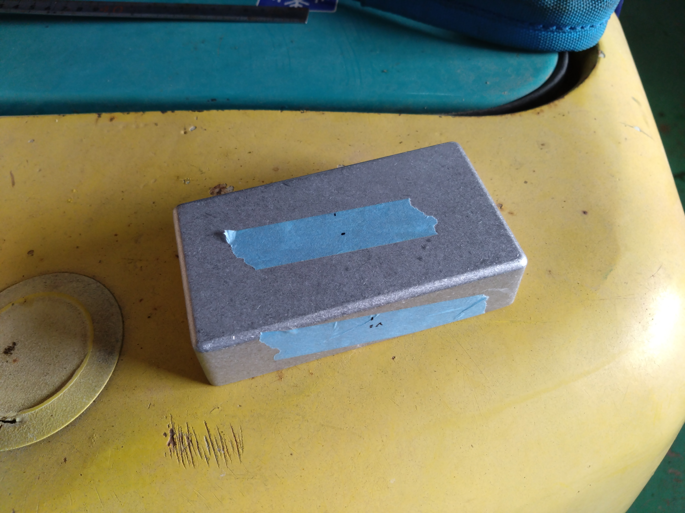
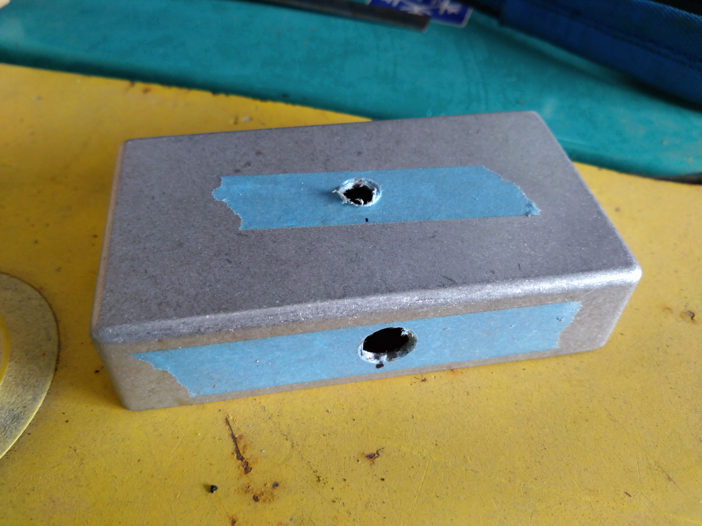

大工さんは色々な道具を使いますが、道具はなるべく持ち替えないように仕事をするそうです。
ということで、今日はドリルを使ってギターにエンドピンジャックを取り付ける穴と、自作プリアンプのケーシングのジャックとボリュームの穴を開けます。

とりあえずたけのこドリルでケーシングにつけるジャックとボリュームにはメインの穴の周りに回転防止の爪がついているので、細いドリルで爪が入る穴を開けました。
ギターの方もたけのこドリルで済むかと思いましたが、エンドピンの位置には角材が入っているようで、長さが足りませんでした。

アルミも木も鉄に比べると柔らかくて加工が楽だなと余裕の気でいたら、いざエンドピンジャックを取り付けようとした際にナットを傷めてしまったようで入っていきません。
ピッチがホームセンターで見ないような細かいネジなので、泣く泣くネットで注文しました。
ということで志半ばで今日は作業中断となりました。

夜な夜なケーシングの中身を配置しようとしたところ、左右のジャックの間にボリュームが入る余地はありませんでした。
ボリュームの穴は開け直しで真ん中に不要な穴が開くことになりました。

## 接ぎ木

今日はナスの接ぎ木です。ベテランのお姉様方が接ぎ木した苗を小生が植えさせていただきます。128穴のセルトレイに大よそ30枚分をこなしました。